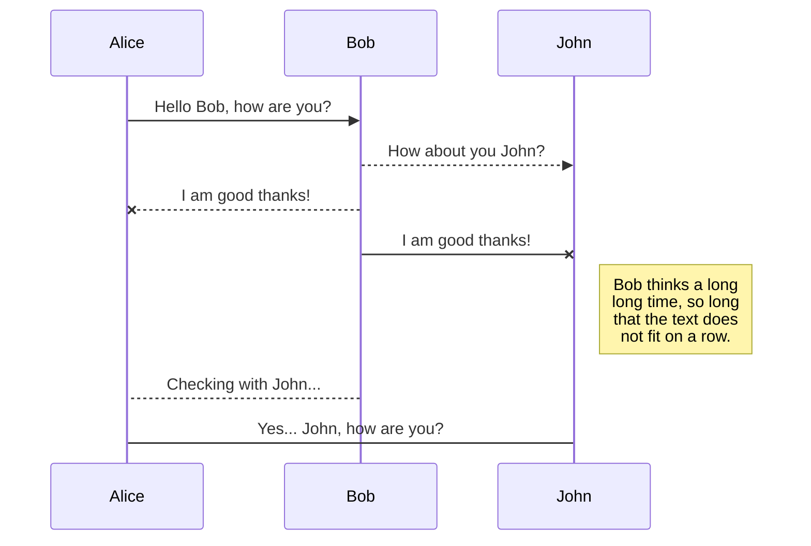
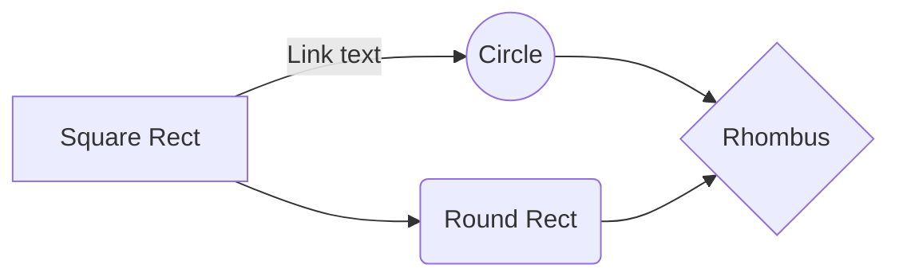

# プログラミングの読み物
##  初めに

コーディングの方法よりも、プログラミングに対する考え方（所謂 **論理思考**、**ロジカルシンキング**など）に着目していく。

## プログラムってどうやって動くの？

そもそもなぜ

## プログラムを

## SmartyPants

SmartyPants converts ASCII punctuation characters into "smart" typographic punctuation HTML entities. For example:

|                |ASCII                          |HTML                         |
|----------------|-------------------------------|-----------------------------|
|Single backticks|`'Isn't this fun?'`            |'Isn't this fun?'            |
|Quotes          |`"Isn't this fun?"`            |"Isn't this fun?"            |
|Dashes          |`-- is en-dash, --- is em-dash`|-- is en-dash, --- is em-dash|

## UML diagrams

You can render UML diagrams using [Mermaid](https://mermaidjs.github.io/). For example, this will produce a sequence diagram:

And this will produce a flow chart:

<!--stackedit_data:
eyJoaXN0b3J5IjpbLTMyMjEzMjczNiwtMTc0MzQ2NDQ2OV19
-->