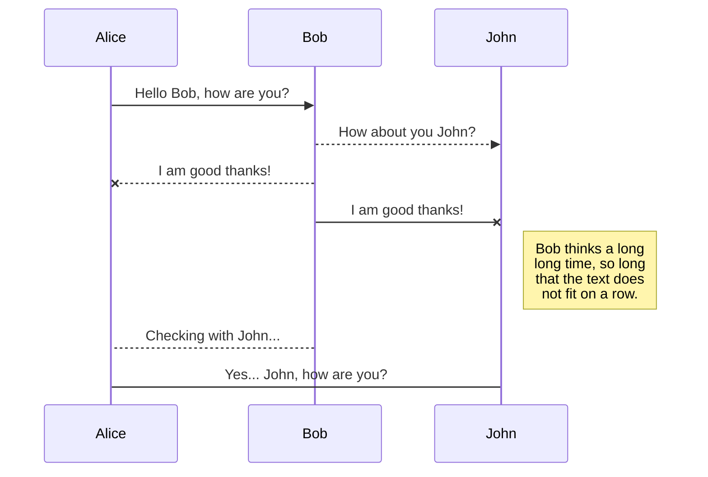
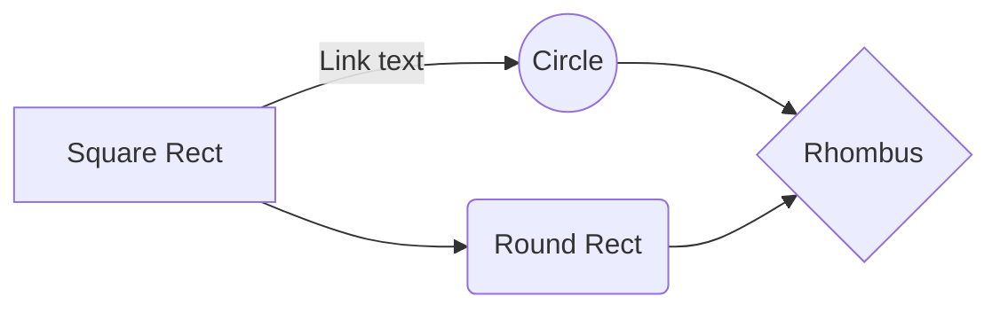

# プログラミングの読み物
## 完成したの？
まだ。
stackedit.io
にて製作中。

##  初めに

コーディングの方法よりも、プログラミングに対する考え方（所謂 **論理思考**、**ロジカルシンキング**など）に着目していきたいと思います。
難しい言い方は避けていきたいので、詳細は別途書籍などを参考にしてください。書籍を読むまでの準備として利用できるように書いていきます。

## プログラムどうして必要なの？何者？

### プログラマって誰
って疑問を持つ人がこれを読むことってあまりなと思いますがとりあえず書きますね。
そもそもなぜ**プログラム**を書く必要があるのでしょうか。
当たり前ですが、人間とコンピュータは別のものです。コンピュータなんて生き物ですらありませんよね。
そんな得体のしれないコンピュータは、昨今本当に力をつけて、コンピュータを使わない日はないほどです。皆さんがお持ちのスマホだって、コンピュータと同様の機器なんです。

目覚ましいIT・コンピュータの発展とともに脚光を浴びている~~と信じたい~~のが**プログラマ**や**システムエンジニア**、**SI**などと呼ばれる職業です。今や呼び名も多岐にわたりますね。一昔前は**SI**という表現はなかったんです。

### なんでこんなに注目されてんの
2020年からは、なんとプログラミングの必修化がされます。小学校で。信じられないですよね。最近は中学校でも技術の時間にhtml書いたりどうのこうのしてます。時代ですね。
この必修化の背景には **IT人材の不足** が挙げられます。現時点でも人手不足です。
この必修化についても掘り下げると長くなるので割愛。

### プログラムって何
コンピュータを使って何ができるのかというと、今や必需品となった**スマートフォンのアプリ**や**Webサイト**、**コンピュータ上で動くアプリケーション**を作ることなんです。勿論他にもありますがプログラム開発に重点を置きます。
さて、例えば本ページを読んでいるあなたに「LINE作ってください」と言われてもコンピュータなしには作れない。コンピュータという道具を用いて作るしかない。包丁なしに魚を捌けないのと同様です。魚を捌くための包丁に当たるものが、**プログラム**なんです。

|  | 料理人 |  プログラマ |
|:--------:| :-------------:| :-------------:|
| 目的 | 料理を作る | アプリを作る |
| 道具 | 包丁 | プログラミング、コンピュータ |

## プログラムってどうやって動くの？

アプリケーションを作るためにプログラミングを行うことはわかりました。でもその指示ってどう出すのでしょうか。
外国の方とお話しする際には英語やその国の言葉を使いますよね。同様に、コンピュータと会話する際には**プログラミング言語**を使うんです。外国語が１種類でないように、プログラミング言語も１種類ではありません。

※ ちなみに
( [主要でもないプログラミング言語200種を一行で解説](https://qiita.com/make_now_just/items/b2ab19f954417c71848d)…。200種類…。 )

脱線しましたが、これらを用いて、コンピュータに指示を出します。

外国語は、それぞれに文法があって、文化があって、流行もあれば廃りもあります。かと思えば似てるような部分もあります。「言葉」という意味では同じだったりしますよね。
プログラミング言語も同様です。言語ごとに**文法**があって**文化**もあって**流行り廃り**があって、**似てるような部分**もあったりするんです。

「は？！どれを選んだらいいんじゃ？！」

という声もよく生徒さんから聞きます。あれもこれも、と選ぶと中途半端になったりごちゃごちゃになってしまうこともしばしば…。
どういう違いがあるの？というのはまた別の記事で。

### 簡単な違い
> どういう違いがあるの？というのはまた別の記事で。

と突き放しはしましたが、ざっくりと説明しますね。分野だけでも興味がでたら調べてみましょう。
1. Webアプリケーション
Ex) Amazon, COOKPAD, Google
ウェブサイトですね。

1. デスクトップアプリケーション
Ex) ブラウザ,ERP,ゲーム
ゲームってなるとジャンルはまた違いますが、デスクトップで動くのでひとまずこちらに分類します。が、**ゲーム開発は別物**です。
ERPとは、簡単に言うと企業で使用されている**給与管理**、**出退勤管理**、**売上管理**、など。企業のペーパレス化等々に貢献してるツールだったりしますね。ちなみに私はERP開発のSIだったりします。

1. スマートフォンアプリケーション
一番なじみがあるのではないでしょうか。LINEやらメールやら、スマホでのゲームやら。これらを作るんですね。わくわくしますか？

1. IoT
最近このワードがCMでも流れるようになりましたね。**インターネットを介してモノを扱う**時代になりました。簡単にいうと、炊飯器や冷暖房など、機械操作を行う分野です。

1. 機械学習・AI
IoT同様これも人気ワードですね。

## プログラム以外に知ること

1. データベース
2. セキュリティ
3. ネットワーク

## 勉強法

### プログラム以外の必要な知識
[IPA](https://www.ipa.go.jp/)主催の国家資格

### プログラムの知識
書け

## 参考書籍
[参考書籍：プログラムはなぜ動くのか](https://www.amazon.co.jp/%E3%83%97%E3%83%AD%E3%82%B0%E3%83%A9%E3%83%A0%E3%81%AF%E3%81%AA%E3%81%9C%E5%8B%95%E3%81%8F%E3%81%AE%E3%81%8B-%E7%AC%AC%EF%BC%92%E7%89%88-%E7%9F%A5%E3%81%A3%E3%81%A6%E3%81%8A%E3%81%8D%E3%81%9F%E3%81%84%E3%83%97%E3%83%AD%E3%82%B0%E3%83%A9%E3%83%A0%E3%81%AE%E5%9F%BA%E7%A4%8E%E7%9F%A5%E8%AD%98-%E7%9F%A2%E6%B2%A2%E4%B9%85%E9%9B%84/dp/4822283151)

## SmartyPants

SmartyPants converts ASCII punctuation characters into "smart" typographic punctuation HTML entities. For example:

|                |ASCII                          |HTML                         |
|----------------|-------------------------------|-----------------------------|
|Single backticks|`'Isn't this fun?'`            |'Isn't this fun?'            |
|Quotes          |`"Isn't this fun?"`            |"Isn't this fun?"            |
|Dashes          |`-- is en-dash, --- is em-dash`|-- is en-dash, --- is em-dash|

## UML diagrams

You can render UML diagrams using [Mermaid](https://mermaidjs.github.io/). For example, this will produce a sequence diagram:

And this will produce a flow chart:

<!--stackedit_data:
eyJoaXN0b3J5IjpbMTkyNjA4Nzk1MSw2MjI0MDgyMjksLTMwMj
A5ODcxNiwxNjc4NzI3NDc3LC0xNzQzNDY0NDY5XX0=
-->