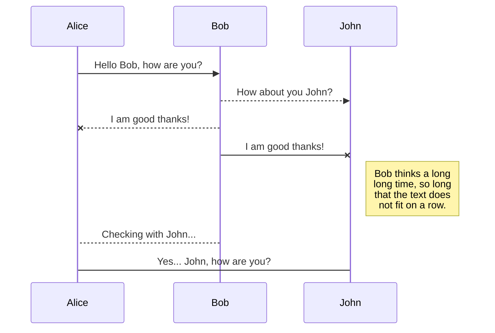
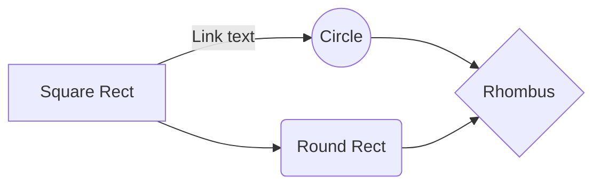

# プログラミングの読み物
##  初めに

コーディングの方法よりも、プログラミングに対する考え方（所謂 **論理思考**、**ロジカルシンキング**など）に着目していきたいと思います。
難しい言い方は避けていきたいので、詳細は別途書籍などを参考にしてください。書籍を読むまでの準備として利用できるように書いていきます。

## プログラムどうして必要なの？

って疑問を持つ人がこ
そもそもなぜ**プログラム**を書く必要があるのでしょうか。
当たり前ですが、人間とコンピュータは別のものです。コンピュータなんて生き物ですらありませんよね。
そんな得体のしれないコンピュータは、昨今本当に力をつけて、コンピュータを使わない日はないほどです。皆さんがお持ちのスマホだって、コンピュータと同様の機器なんです。

目覚ましいIT・コンピュータの発展とともに脚光を浴びている~~と信じたい~~のが**プログラマ**や**システムエンジニア**、**SI**などと呼ばれる職業です。今や呼び名も多岐にわたりますね。一昔前は**SI**という表現はなかったんです。

## プログラムってどうやって動くの？

## プログラム以外に知ること

1. データベース
2. セキュリティ
3. ネットワーク

## 勉強法

### プログラム以外の必要な知識
[IPA](https://www.ipa.go.jp/)主催の国家資格

### プログラムの知識
書け

## SmartyPants

SmartyPants converts ASCII punctuation characters into "smart" typographic punctuation HTML entities. For example:

|                |ASCII                          |HTML                         |
|----------------|-------------------------------|-----------------------------|
|Single backticks|`'Isn't this fun?'`            |'Isn't this fun?'            |
|Quotes          |`"Isn't this fun?"`            |"Isn't this fun?"            |
|Dashes          |`-- is en-dash, --- is em-dash`|-- is en-dash, --- is em-dash|

## UML diagrams

You can render UML diagrams using [Mermaid](https://mermaidjs.github.io/). For example, this will produce a sequence diagram:

And this will produce a flow chart:

<!--stackedit_data:
eyJoaXN0b3J5IjpbLTEzNDgwNTgxNTcsMTY3ODcyNzQ3NywtMT
c0MzQ2NDQ2OV19
-->